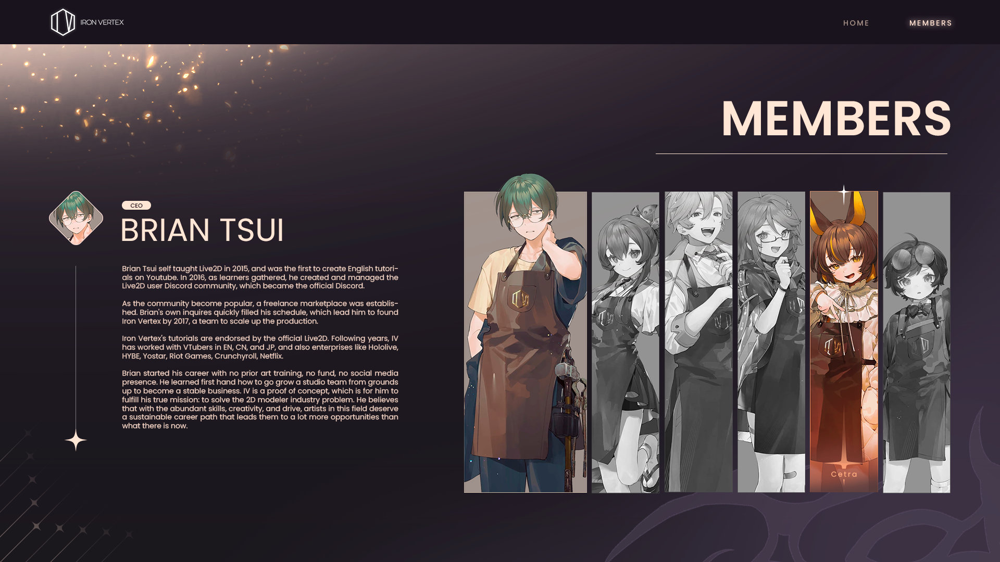

# 🌟 IronVertex Fan Template (v0.1)

  

  
  
  
  

---

**A fan-made web interface inspired by the official [Iron Vertex](https://ironvertex.com/)** — built with **React + Vite** and styled with **pure CSS**.  
This project is a **personal experiment** and a **creative tribute** to the Iron Vertex production team and their inspiring work in the VTuber industry.

---

## 💡 About the Project

This project is not affiliated with Iron Vertex.  
It’s a **fan-created web front-end** designed to practice web development, explore UI concepts, and pay homage to the aesthetic and professional presence of Iron Vertex.

The current version (v0.1) focuses on creating a **simple and clean multi-section interface**, introducing the **members area** and basic navigation between the main sections.

---

## 🚀 Features

- ⚡ **Built with Vite + React.js**
- 🎨 **Full custom CSS styling** (no frameworks)
- 🧩 **Modular structure** for pages and components
- 🌐 **Responsive layout** inspired by modern VTuber websites

---

## 🗂️ Current Modules (v0.1)

1. **Home** – Landing page introducing the project.  
2. **Members** – Displays featured members (main section for v0.1).  
3. **Portfolio** – Placeholder for future creative showcases.  
4. **Contact Us** – Simple section for social or contact links.

---

## 🏗️ Project Goals

- Experiment with **modern front-end tools** (React + Vite).  
- Develop clean, maintainable **component-based code**.  
- Practice **responsive web design** with pure CSS.  
- Recreate a **professional and fan-inspired visual identity**.

---

## 🧰 Tech Stack

| Tool | Description |
|------|--------------|
| **React.js** | Front-end library for building the UI |
| **Vite** | Fast build tool for modern JavaScript projects |
| **CSS3** | For styling and layout |
| **WebP Assets** | Optimized media for performance |

---

## ⚠️ Disclaimer

This project is **not affiliated, endorsed, or sponsored by Iron Vertex**.  
It’s purely a **fan project** created for **learning, inspiration, and appreciation**.

All credits for original branding, logos, and names go to **Iron Vertex** and their respective owners.  
Visit the official website at 👉 [https://ironvertex.com/](https://ironvertex.com/)

---

## 📦 Future Plans

- Add dynamic content for portfolio and news sections.  
- Introduce animations and interactive effects.  
- Polish layout and accessibility.  
- Expand into a full responsive site concept.

---

## ❤️ Author

**Miguel Ángel Ayala**  
Front-end Developer & Designer  
📍 Bogotá, Colombia  
✨ _“Created for learning. Built with passion.”_

---
